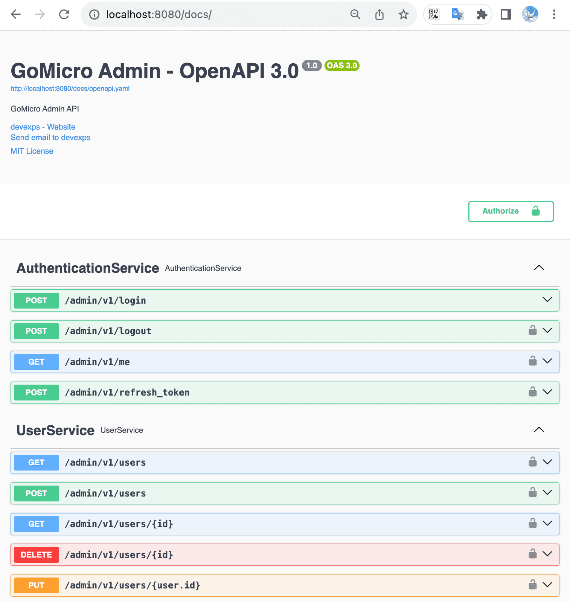
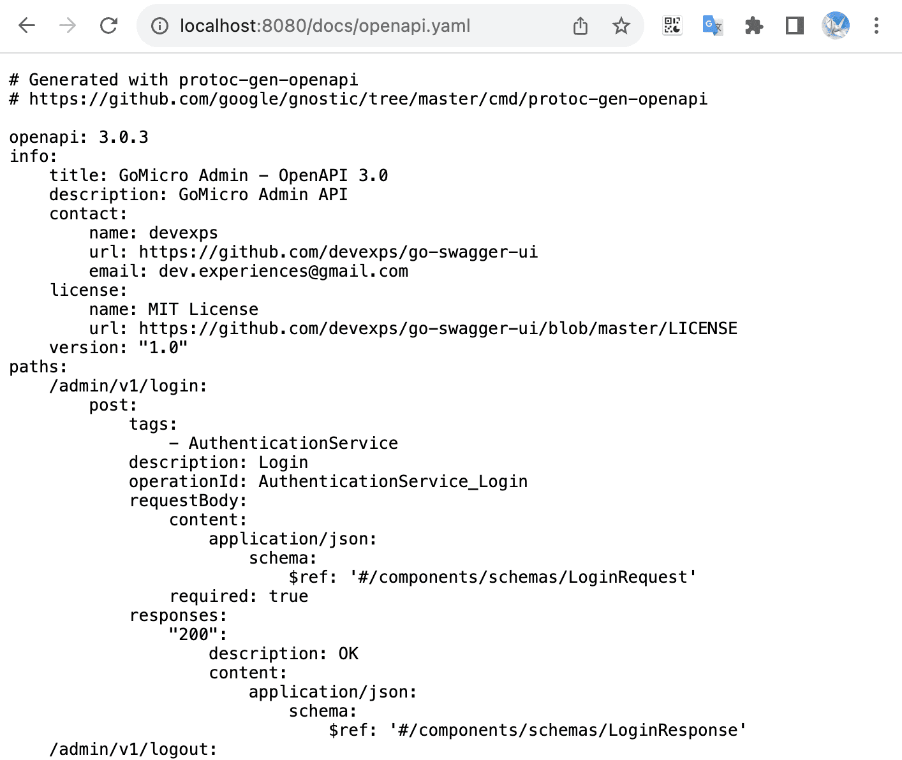

---
title: Golang microservice framework (Go-Micro) easily integrates and uses Swagger UI
description: Golang microservice framework (Go-Micro) easily integrates and uses Swagger UI
tags: [go-micro, microservice, framework, swagger, monolithic, examples]
image: /assets/thoughts/go-micro/go-micro-and-swagger-ui/screenshot-000.png
hide_table_of_contents: false
--- 
<!--truncate-->

## Overview

In our development, debugging interfaces, testing interfaces, and providing interface documents to the front-end are all very frequent tasks.
So, what methods and tools do we need to implement these tasks?

**Swagger, or OpenAPI**

Let us first understand what `Swagger` is and what `OpenAPI` is.

## What is OpenAPI

`OpenAPI` is the global standard for writing RESTful APIs. 
It's a specification that allows developers around the world to standardize the design of APIs and follow to all security, versioning, error handling, and other best practices when writing REST APIs from scratch.
Rather than just starting from the scratch, even existing APIs can be find-tuned to comply with global standard.

Furthermore, following established standards when developing products can be highly beneficial.

Originally, `OpenAPI` was called the `Swagger` specification. 
`Swagger` propose best practices for building APIs, and these best practices the `OpenAPI` specification.

Tools like [SwaggerHub](https://swagger.io/tools/swaggerhub/) help developers build APIs in a browser-based editor, comply with standards, and have complete control over the design process.

Using tools like [Swagger Inspector](https://swagger.io/blog/swagger-inspector-sunset/), we can also generate our own API specifications and pass them on to other teams in the organizations.

For further information, please view [the OpenAPI specification](https://swagger.io/resources/open-api/) here.

## What is Swagger

`OpenAPI` is a specification for writing API documents.
However, it's very troublesome to manually write `OpenAPI` specification documents. So, `Swagger` is a toolset that implements the `OpenAPI` specification.

Official website: [swagger.io](https://swagger.io/)

Toolset included with `Swagger`:
- **Swagger Editor** : Swagger Editor allows editing `OpenAPI` specifications in YAML in the browser and previewing the document in real time.
- **Swagger UI** : Swagger UI is a collection of HTML, Javascript, and CSS assets that can dynamically generate beautiful documentation from OAS-compliant APIs.
- **Swagger Codegen** : Allows automatic generation of API client libraries (SDK generation), server stubs and documentation according to the `OpenAPI` specification.
- **Swagger Parser** : Standalone library for parsing `OpenAPI` definitions from Java.
- **Swagger Core** : Java-related library for creating, consuming, and consuming `OpenAPI` definitions.
- **Swagger Inspector (Free)** : API testing tool that allows you to verify your API and generate `OpenAPI` definitions from existing APIs.
- **SwaggerHub (free and commercial)** : API design and documentation, built for teams using `OpenAPI`.

## How to integrate Swagger into Go-Micro

First of all, what we need to understand is: the only way to integrate `Swagger` in the project is to integrate it through the `Swagger UI`.

`Swagger UI` relies on reading API documents in `json` or `yaml` format of `OpenAPI`. This document is not read by humans, but by `Swagger UI`.
Similarly, it's not written by humans, but is generated by a generator.

Therefore, first we need to understand how the API documents are generated.

### How are API documents generated?

Because Go-Micro relies on `Protobuf` and `gRPC` to design APIs, we can generate them with relevant generator tools.

`Protobuf` is a DSL language that requires a tool called `protoc` to compile and convert the API into the target language.
And its specific tools are implemented by plug-ins.

There are currently two `OpenAPI` generation plug-ins written in `Go`:
- OpenAPIv2 generator: [protoc-gen-openapiv2](https://github.com/grpc-ecosystem/grpc-gateway/tree/main/protoc-gen-openapiv2)
- OpenAPIv3 generator: [protoc-gen-openapi](https://github.com/google/gnostic/tree/main/cmd/protoc-gen-openapi)

We can install it with the following command:
```shell
go install github.com/grpc-ecosystem/grpc-gateway/v2/protoc-gen-openapiv2@latest
go install github.com/google/gnostic/cmd/protoc-gen-openapi@latest
```

The directly generated command is quite simple. For example:

Generate OpenAPI v2 json documentation:
```shell
protoc --proto_path=. --openapiv2_out=paths=source_relative:../ --openapiv2_opt logtostderr=true --openapiv2_opt json_names_for_fields=true ./*.proto
```

Generate OpenAPI v3 yaml documentation:
```shell
protoc --proto_path=. --openapi_out=naming=json=paths=source_relative:../ ./*.proto
```

However, it's very inconvenient to use commands directly.
We can use a tool called [Buf.Build](https://buf.build/) for engineering generation.

Installing Buf.build is a simple task:
```shell
go install github.com/bufbuild/buf/cmd/buf@latest
```

Then we need to create `buf.work.yaml`, `buf.yaml`, `buf.gen.yaml` and other configuration files in the root directory of the project.
This article will not explain in detail how to configure these configuration files.
You can find tutorials to learn by yourself.
This article only focuses on the relevant knowledge of generating `OpenAPI`.

To generate `OpenAPI`, we also need to create a configuration file `buf.openapi.gen.yaml` and place it in the same directory as `proto`. For example:
```yaml
version: v1
managed:
  enabled: false
plugins:
  # generate openapi v2 json doc
#  - name: openapiv2
#    out: ../docs
#    opt:
#      - json_names_for_fields=true
#      - logtostderr=true

  # generate openapi v3 yaml doc
  - name: openapi
    out: ./app/admin/service/cmd/server/assets
    opt:
      - naming=json
      - depth=2
      - paths=source_relative
```

Then, we can use the following command in the root project directory to generate:
```shell
buf generate --path api/admin/service/v1 --template api/admin/service/v1/buf.openapi.gen.yaml
```

Finally, under this directory `./app/admin/service/cmd/server/assets`, a file with the name `openapi.yam` will be generated.

### How to introduce the openapi.yaml file into Swagger UI?

Yes, it's about integrating `Swagger UI`.

In order to do this, We need to do a few things:
- Generate `OpenAPI` documents from `Buf`, compile and run the program and write it into `Makefile`.
- Use the features of Golang `Embedding Files` to embed `openapi.yaml` it into the service program.
- Integrate `Swagger UI` into the project and read embedded `openapi.yaml` documentation.

So, we first start writing the `Makefile`:
```makefile
# generate protobuf api go code
api:
	buf generate

# generate OpenAPI v3 docs.
openapi:
	buf generate --path api/admin/service/v1 --template api/admin/service/v1/buf.openapi.gen.yaml
	buf generate --path api/front/service/v1 --template api/front/service/v1/buf.openapi.gen.yaml

# run application
run: api openapi
	@go run ./cmd/server -conf ./configs
```

In this way, we only need to run `make openapi` to generate `OpenAPI`. 
When debugging and running, enter the command `make run` to generate `OpenAPI` and run the program.

The `Makefile` is written, now we go to this directory `./app/admin/service/cmd/server/assets`, and we create a code file named `assets.go`:
```go
package assets

import _ "embed"

//go:embed openapi.yaml
var OpenApiData []byte
```

In this way, we embedded the `openapi.yaml` file into the program.

Finally, we need to integrate `Swagger UI`. I've packaged a project for this, to use it we need:
```shell
go get -u github.com/devexps/go-swagger-ui
```

Call the method in the package where the HTTP server is created:
```go
package server

import (
    rest "github.com/devexps/go-micro/v2/transport/http"
    swaggerUI "github.com/devexps/go-swagger-ui"

    "demo-project/app/admin/service/cmd/server/assets"
)

func NewHTTPServer() *rest.Server {
    srv := CreateHttpServer()

    swaggerUI.RegisterSwaggerUIServerWithOption(
        srv,
        swaggerUI.WithTitle("Admin Service"),
        swaggerUI.WithMemoryData(assets.OpenApiData, "yaml"),
    )
}
```

From there we are done!

If the port of the API service is `8080`, then we can click the link to access the `Swagger UI`.

http://localhost:8080/docs/



At the same time, the `openapi.yaml` file can also be accessed online:

http://localhost:8080/docs/openapi.yaml



## Conclusion

As a programmer, laziness is a virtue in my opinions, because if you want to be lazy, you must try your best to improve the process, create tools, and automate what ever can be automated.
The integration of `Swagger UI` has indeed reduced the workload of mine and the team at work and improved development efficiency.

If you still don't understand anything about `Go-Micro` integrating `Swagger UI`, I have an open source project with complete application code for you:

- [https://github.com/devexps/go-swagger-ui](https://github.com/devexps/go-swagger-ui)
- [https://github.com/devexps/go-monolithic-demo](https://github.com/devexps/go-monolithic-demo/tree/main/backend)

## References

- https://swagger.io/
- https://swagger.io/tools/swaggerhub/
- https://swagger.io/blog/swagger-inspector-sunset/
- https://swagger.io/resources/open-api/
- https://buf.build/
- OpenAPIv2 generator: [protoc-gen-openapiv2](https://github.com/grpc-ecosystem/grpc-gateway/tree/main/protoc-gen-openapiv2)
- OpenAPIv3 generator: [protoc-gen-openapi](https://github.com/google/gnostic/tree/main/cmd/protoc-gen-openapi)